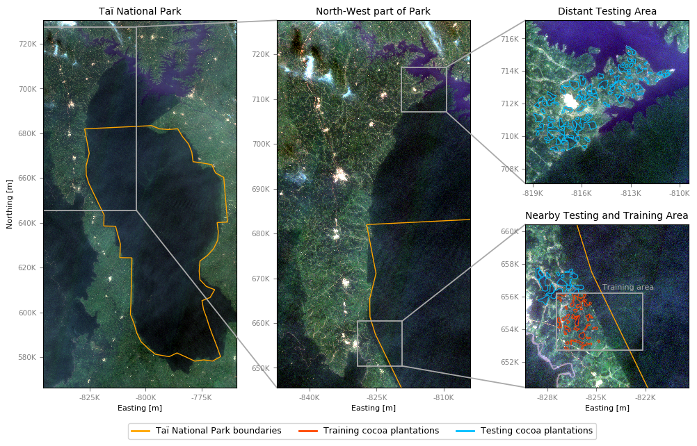
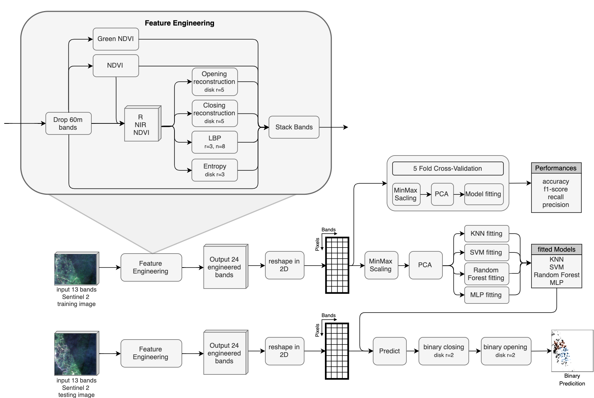
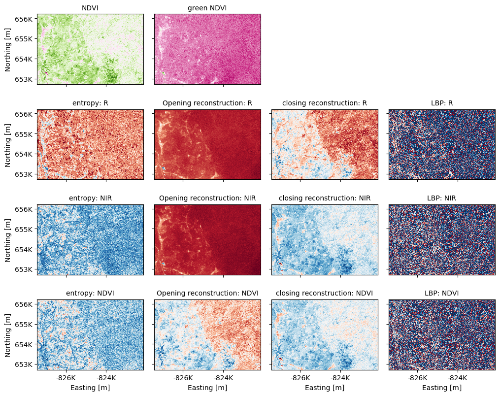
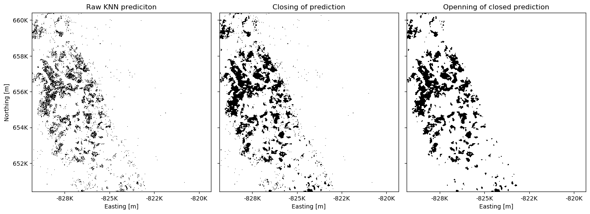
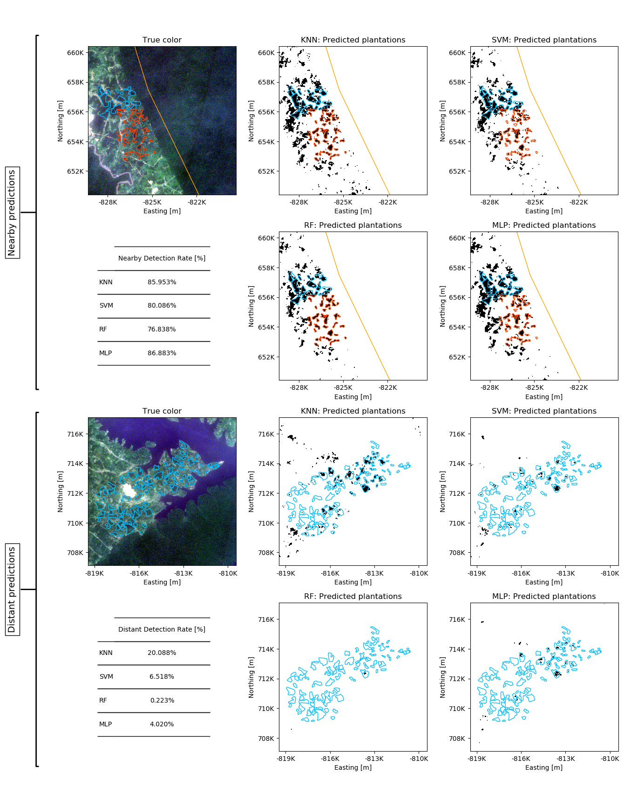
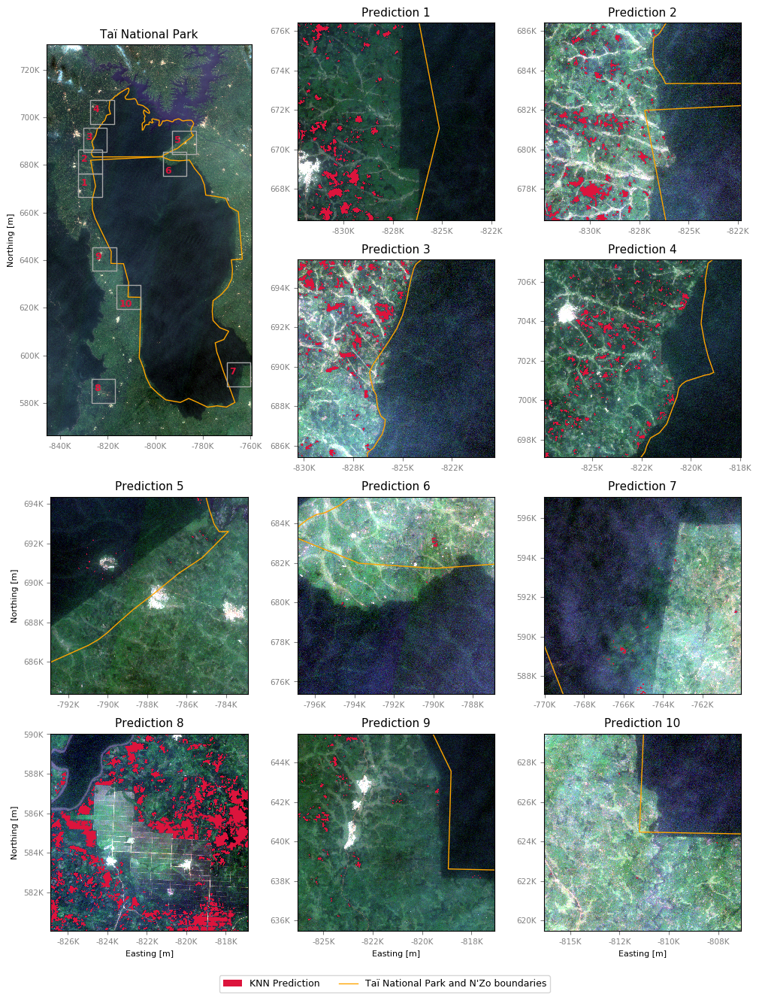

# Detecting Cocoa Plantation in Ivory coast

In the context of the _Image Processing for Earth Observation_ EPFL course (ENV-540)
___

## Goal
In the context of climate crisis we are facing, deforestation is an ever increasing problem, destroying precious carbon dioxide intake. In Ivory coast, the deforestation has reached an impressive magnitude mainly for cocoa plantations. As a results only few places of wild forest remains among which the Taï national park, situated South-West of the country close to the border with Liberia. This 3300 km2 protected area is a refuge for a multitude of species. Preserving it is thus an important challenge. The present project propose a machine learning approach based on remote sensing images. The goal is to build a classifier able to decide whether a pixel from Sentinel-2 image belongs to a coca plantations.

## Data

The classifier is developed on the free Sentinel-2 L1C images dated of the 29 of December 2018 (a day without clouds over the whole park). The Sentinel-2 images have 13 bands (4 at 10 meter resolution, 6 at 20 meters, and 3 at 60 meters resolution) that goes from the visible spectrum to the infrared.

|  Platform  | Sensor |   source   | Acquisition method |          Acquisition Date         | Resolution Spatial | Resolution Spectral | Resolution Radiometric |    CRS    | Type of product |
|:----------:|:------:|:----------:|:---------------------:|:------------------------------------:|:---------------------:|:----------------------:|:-------------------------:|:---------:|:---------------:|
| Sentinel-2 |   L1C  | EO-browser |      Sentinel-Hub     | between 24.10.2019 and 02.12.2019 |          10m          |        13 bands        |        uint 16 bits       | EPSG:4326 |       RAW       |

The model is trained on a small area in which there are known plantations (cf Figure [Overview](#overview)). The training area have been completely labeled for the binary problem : plantation vs no plantation using the high resolution images from Google Earth. Other _testing_ areas have been labeled for *some* known plantation. Those labeled area will be used to test if the classifier generalize over space.

## Method

The model development unfolds on four steps summarized on figure [Processing Pipeline](#processing pipeline)
1. **Feature Engineering** make use of the 10m and 20m bands to build 14 new _bands_. The classical and green NDVI. Then each of the R, IR and NDVI are transformed using _Opening_ and _Closing_ by reconstruction, _Local Binary Pattern_ and the _Local Entropy_.

2. **Model Performances estimation** The 24 bands are reshaped in a 2D array where each sample is a pixel in represented by 24 features. The trained model is composed of a Normalized followed by a PCA and an estimator. Four estimator are tried : KNN, SVM, Random Forest and a MLP. The performances are estimated through a 5-folds Cross-validation (CV). _Note that the normalized, PCA, and estimator are fitted after the training set is defined (through the `sklearn.pipeline.Pipeline`)_. The CV report the training and testing performance through the _accuracy_, the _f1-score_, the _recall_ and the _precision_.

3. **Model Fitting** The same architecture are trained on the whole data available (all the pixels in the training area).

4. **Prediction on Testing area** The four models are used to predict the unseen _nearby_ and _distant_ plantations to assess their space generalization capabilities. Because the whole image have not been labeled, the quality of the predictions is assessed through the _detection rate_ which represent the fraction of the labeled polygon that have been detected. Therefore a model predicting plantations everywhere would have a 100% detection rate. To control for that pitfall, the image are also qualitatively observed.

## Results

### Features Engineering
The figure [Feature engineering](#Feature engineering) presents the additional features obtained from the Red, Near-Infrared and NDVI bands. The NDVI is an index reflecting the of vegetation and can thus help to discriminate plantations from native forest. The goal of the _entropy_, the _LBP_, the _opening_ and _closing by reconstruction_ is to add informations about local structures in the pixel as the arrangement of pixel together carries a lot of information.

### Models Performances

In the table below is presented the performances of the four models obtained through a 5-folds cross-validation. The accuracy, f1-score, precision and recall are reported for both the train and test fold(s) as the mean and standard deviation over the different folds arrangements.
 
The best performing model on the training area appears to be the MLP. The RF seems to have overfitted as the train and test scores strongly differ. The rather low detection rate (recall) may be due to a _sparse_ spatial prediction : the overall patch is detected but with a lot non-detected pixel. The morphological post processing aims at correcting this behavior and increase the spatial relevance of the predictions.

|           |       | KNN    |       | SVM    |        | RF     |        | MLP    |        |
|-----------|-------|--------|-------|--------|--------|--------|--------|--------|--------|
|           |       | mean   | std   | mean   | std    | mean   | std    | mean   | std    |
| accuracy  | test  | 92.93% | 0.94% | 89.96% | 7.68%  | 94.14% | 0.69%  | 94.14% | 1.31%  |
|           | train | 95.75% | 0.15% | 91.27% | 4.13%  | 99.86% | 0.02%  | 95.46% | 0.21%  |
| f1        | test  | 47.77% | 3.46% | 42.45% | 17.90% | 51.61% | 3.09%  | 57.64% | 4.63%  |
|           | train | 68.49% | 1.33% | 44.24% | 14.59% | 99.04% | 0.17%  | 67.30% | 1.63%  |
| precision | test  | 52.97% | 7.99% | 57.30% | 23.11% | 67.82% | 11.47% | 63.84% | 12.71% |
|           | train | 74.56% | 1.06% | 54.16% | 16.25% | 98.71% | 0.14%  | 70.87% | 1.76%  |
| recall    | test  | 44.18% | 4.35% | 53.57% | 36.47% | 43.19% | 7.47%  | 54.00% | 5.11%  |
|           | train | 63.34% | 1.75% | 54.06% | 34.96% | 99.36% | 0.27%  | 64.10% | 2.22%  |

### Testing : Generalization over space
The figure [Morphological Post-Processing](#Morphological Post-Processing) presents the effect of the post treatment applied to the predictions reshaped as images. The successive closing and opening removes the salt and pepper noise to yield satisfying prediction patches.

The model is trained only on a single spot around the Taï national park. Therefore, the models built may be too specific to the training area. In order to test how the models generalize over space, they are used to predict two area where some known plantations have been labeled :
* **Nearby** predictions represent plantations that are close to the training area (blue polygons).
* **Distant** predictions represent plantations away from the training area, around 60 km north close to a lake.

The results of the testing over space are presented on the figure [Testing predictions](#Testing predictions). All the four models seems to generalize locally as the blue patches are mostly filled. However, over a longer distance, KNN seems to be the best as it detect 20% of the labeled plantations. The location may be hard to predict with the presence of the water body that may induce atmospheric effect different than the training area.

## New Predictions
KNN is used to make some prediction on various part of the park to control whether cocoa plantations are detected within the park. The interpretation must be made carefully as the model does not fully generalize over space as seen before. Therefore the prediction closer to the training area are consider more trustable. The predictions are presented on figure [predictions](#Predictions).

